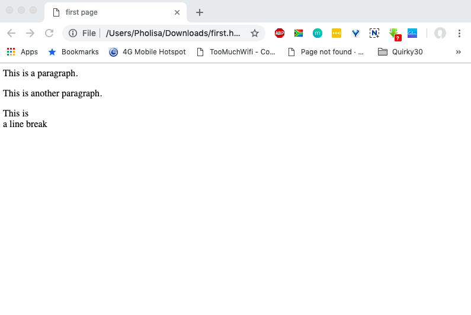

# Single Line Break Continued

## Single Line Break

Opening the HTML file in the browser shows that a single line break has been added to the paragraph:


The &lt;br /&gt; element has no end tag.


