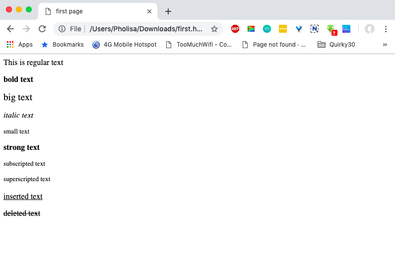

# Text Formatting

## Formatting Elements

In HTML, there is a list of elements that specify text style.  
  
Formatting elements were designed to display special types of text:

```markup
<html>
  <head>
    <title>first page</title>
   </head>
   <body>
     <p>This is regular text </p>
     <p><b> bold text </b></p>
     <p><big> big text </big></p>
     <p><i> italic text </i></p>
     <p><small> small text </small></p>
     <p><strong> strong text </strong></p>
     <p><sub> subscripted text </sub></p>
     <p><sup> superscripted text </sup></p>
     <p><ins> inserted text </ins></p>
     <p><del> deleted text </del></p>
   </body>
</html>
```

[Try It Yourself](https://codepen.io/Pholisa-Fatyela/pen/ErGYjW/)


The &lt;strong&gt; tag is a phrase tag. It defines important text.


Each paragraph in the example is formatted differently to demonstrate what each tag does:




Browsers display &lt;strong&gt; as &lt;b&gt;, and &lt;em&gt; as &lt;i&gt;.  
However, the meanings of these tags differ: &lt;b&gt; and &lt;i&gt; define bold and italic text, respectively, while &lt;strong&gt; and &lt;em&gt; indicate that the text is "**important**".


