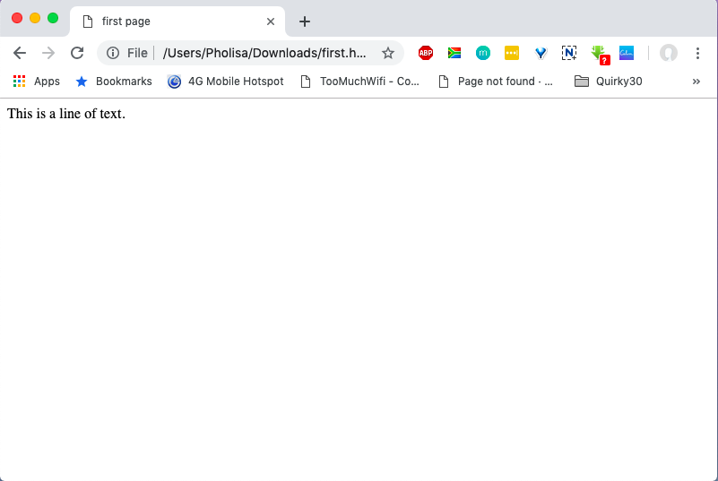

# The HTML File

## The HTML File

Add the basic HTML structure to the text editor with "This is a line of text" in the body section.

```markup
<html>
 <head>
 </head>
 <body>
 This is a line of text.
 </body>
</html>
```

[Try It Yourself](https://codepen.io/Pholisa-Fatyela/pen/jdQgOp/)

In our example, the file is saved as **first.html**   
  
When the file is opened, the following result is displayed in the web browser:




Don’t forget to save the file. HTML file names should end in either **.html** or **.htm**


