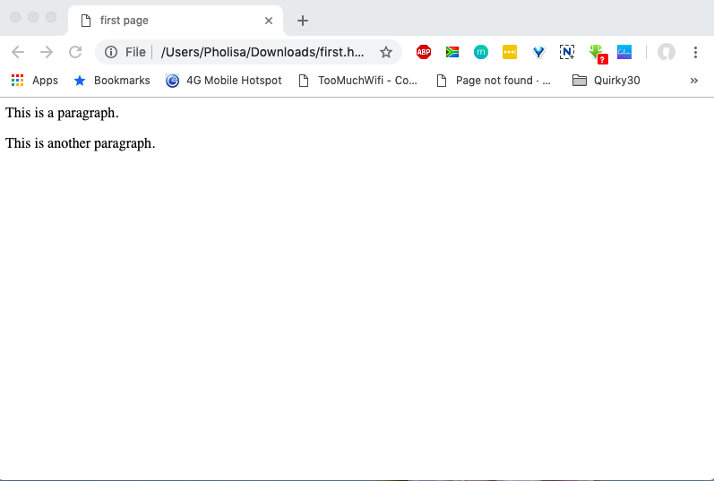

# Paragraphs

## The &lt;p&gt; Element

To create a paragraph, simply type in the **&lt;p&gt;** element with its opening and closing tags:

```markup
<html>
 <head>
 <title>first page</title>
 </head>
 <body>
 <p>This is a paragraph. </p>
 <p>This is another paragraph. </p>
 </body>
</html>
```

[Try It Yourself](https://codepen.io/Pholisa-Fatyela/pen/vbQoaW/)

**The result:**




Browsers automatically add an empty line before and after a paragraph.


