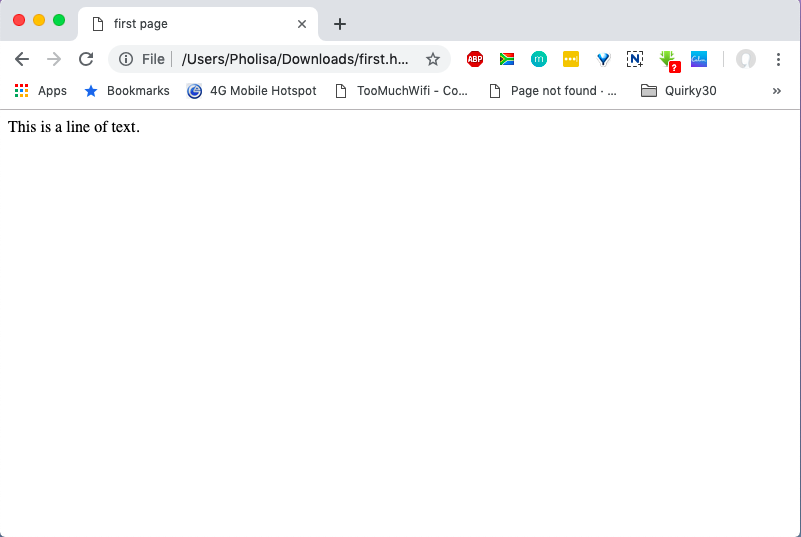

# Tittle Tag

## The &lt;title&gt; Tag

To place a title on the tab describing the web page, add a &lt;title&gt; element to your head section:

```markup
<html>
 <head>
 <title>first page</title>
 </head>
 <body>
 This is a line of text.
 </body>
</html>
```

[Try It Yourself](https://code.sololearn.com/6/#html)

This will produce the following result:




The title element is important because it describes the page and is used by search engines.


