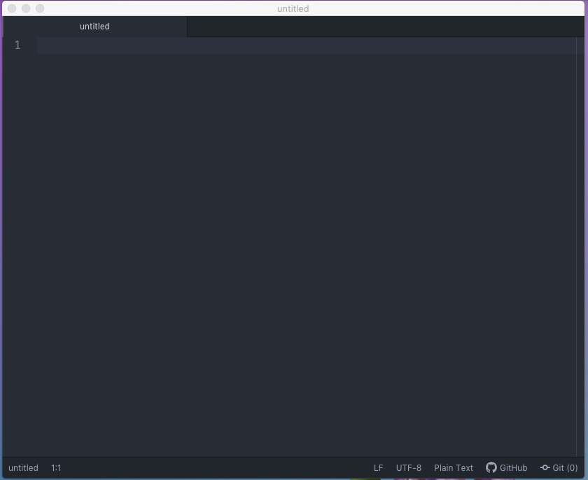

# Creating Your First HTML Page

## The HTML File

HTML files are text files, so you can use any **text editor** to create your first webpage.   
There are some very nice HTML editors available; you can choose the one that works for you. 

For now let's write our examples in **Atom**.


You can run, save, and share your HTML codes on our **Code Pen** or **JSFiddle**, without installing any additional software.


